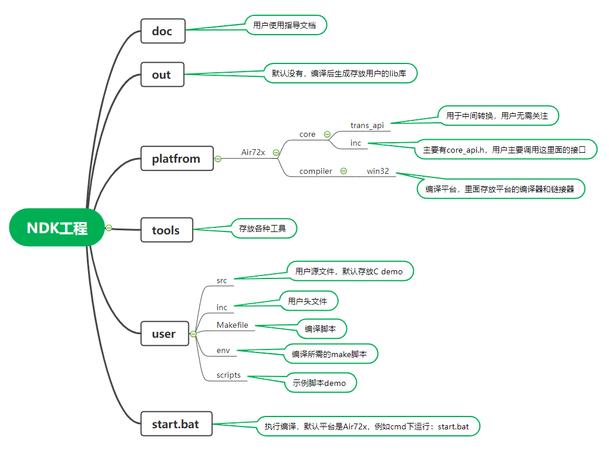
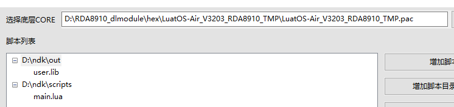

# 一、简介

## 开始使用

NDK(Native Development Kit)是一种基于原生程序接口的软件开发工具包，可以让您合成独立的C/C++库，在luatOS中使用，从而进行应用的深度开发。拥有了NDK环境，在luatOS提供的众多硬件环境中重复利用您的代码（前提是NDK支持了该平台）。NDK构建简单，您不需要进行繁琐的环境搭建，直接运行bat文件即可编译好您的库。


## 目录结构




## 应用场景

如果您有以下一个或者多个想法，那么 NDK 就是为您量身定做的：

- lua运行效率达不到要求，需要进一步提升。
- 已有成熟的C代码，希望能够对接lua进一步开发。
- 渴望使用其他开发者的 C 或 C++ 库进行lua开发。
- 希望关键代码能够受到保护，避免lua容易被反编译的风险。
- 向第三方开发者分享您自己的库，不需要发您的源代码。


# 二、构建您的项目


## 1. 基础构建

目前的NDK环境默认支持Air72x平台，该平台的编译环境不需要我们安装，NDK本身就自带有编译器。对于C开发者来说，环境搭建是个繁琐的步骤，而现在我们只需下载NDK，之后按照：

- 将源文件copy到NDK的`user/src`目录下，头文件相应放到`user/include`目录下。

操作完之后，基础环境就算是搭建好了，简单又方便。


## 2. 编写C库

### 2.1 如何编写

- 在NDK\platform\xxx\core 目录下存放的是底层的头文件，底层提供的接口会全部放在core_api.h里面。

- 用户只能调用core_api.h提供的外部接口，包括标准库的接口。

- 用户如果想调用底层的接口，只需要添加#include "core_api.h" 即可，不需要自行copy头文件。

- 编写好的C库文件仅需要为lua提供相应函数即可。

- 用户的函数如果需要异步通知lua虚拟机怎么办？

  这个应用场景多数是异步操作，执行接口后，需要异步通知lua端，这里引入了消息机制，具体实现如下接口所示：

  ```c
  /*
  发消息通知lua端，下面编写脚本部分会介绍lua端如何接收消息
  函数名：OPENAT_msg_to_lua
  参数：msg_id：用户自定义的消息id，用于区分多种消息
      result：用户自定义的消息结果，默认FALSE
      num: 用户自定义，用于传输数值数据
      data: 用户自定义，用于传输文本数据，用户如果malloc后需要调用该接口后free，底层会做copy
      dataLen：文本数据长度
  */
  
  bool OPENAT_msg_to_lua(UINT8 msg_id,BOOL result,INT32 num,CHAR* data,UINT32 dataLen);
  ```


### 2.2 生成lib库文件

- 在NDK根目录下运行`start.bat`。
- 运行结束后会在NDK的根目录下生成`out`文件夹，里面有`user.lib`，就是合成好的静态库。


## 3. 编写lua脚本


### 3.1 lua接口介绍

为了实现静态库的动态加载，NDK版本提供了`dl`库供lua使用，该库目前有dl.open、dl.sym和dl.close三个重要的接口。

#### dl.open

导入静态库

- 语法

  `handle = dl.open(lib)`

- 参数

  | 传入值 | 释义                               |
  | ------ | ---------------------------------- |
  | lib    | lib库所在的路径。如：/lua/user.lib |

- 返回值

  handle：库的句柄

#### dl.sym

动态调用静态库函数

- 语法

  `ret = dl.sym(handle,fun,ret_type,arg1,arg2,arg3....)`

- 参数

  | 传入值   | 释义                                                         |
  | -------- | ------------------------------------------------------------ |
  | handle   | 打开库返回的句柄                                             |
  | fun      | 需要调用的函数名，字符串表示                                 |
  | ret_type | 返回值，目前有两种分别为：*dl.RETURN_NUMBER(可以返回一个bool，int, 句柄等)*    dl.RETURN_STRING(返回一个字符串) |
  | argx     | 函数的参数，可以是number类型和string类型                     |

- 返回值

  ret ：根据参数`ret_type`而返回实际的值。

#### dl.close

卸载动态库

- 语法

  `dl.close(handle)`

- 参数

  | 传入值 | 释义             |
  | ------ | ---------------- |
  | handle | 打开库返回的句柄 |

- 返回值

  nil

​	

### 3.2 lua脚本编写

- 载入库：调用用户自定义的库接口之前，都需要先载入库，使用dl.open接口导入需要的静态库即可；

- 调用库接口：使用dl.sym接口调用库接口：

  ```c
  local ret_number = dl.sym(handle, "fun1", dl.RETURN_NUMBER, 100)
  ```

​		注意：如果没有参数传入，第四个参数可以不填，但是不管有没有参数返回，参数的返回类型必须指定。

- 订阅消息：C与lua之间使用消息机制进行通信，上面说了C库中如何发消息给lua，这里说下lua如何异步接收C库传的消息：

  ```Lua
  local function dl_msg_pro(msg)
      print(msg.msg,msg.num,msg.data,msg.result)
  end
  
  rtos.on(rtos.MSG_DL_INFO, dl_msg_pro)
  ```

- 卸载库:

​		如果您之后的lua代码不在需要用到dl.open导入的静态库文件，可以使用dl.close卸载该静态库，释放内存，保证较高的执行效率。


# 三、代码下载

- 底层固件选择支持NDK的固件库。
- 通过增加脚本文件按钮，选择lua脚本和NDK\out目录下的user.lib，如下图所示：



- 点击下载即可。


# 四、代码示例

## C库demo

```c
/*test.c*/
#include "core_api.h"

/*测试函数1，由lua直接调用*/
int fun1(int number)
{
    OPENAT_lua_print("fun1 exe number=%d", number);
    return number;
}

/*测试函数2, 由lua直接调用*/
char* fun2(char *string)
{
    OPENAT_lua_print("fun2 exe string=%s", string);
    fun1(10000);
    return string;
}
```

## lua脚本demo

```lua
PROJECT = "DL_TEST"
VERSION = "1.0.0"

--加载日志功能模块，并且设置日志输出等级
--如果关闭调用log模块接口输出的日志，等级设置为log.LOG_SILENT即可
require "log"
LOG_LEVEL = log.LOGLEVEL_TRACE
require "sys"

rtos.sleep(3000)
--导入user.lib库
local handle = dl.open("/lua/user.lib")
--判断库是否导入成功
if handle then  
    --调用fun1，并指定返回值为RETURN_NUMBER类型，传入的参数是100
    local ret_number = dl.sym(handle, "fun1", dl.RETURN_NUMBER, 100)
    local ret_string = dl.sym(handle, "fun2", dl.RETURN_STRING, "hello")

    print("ret_number", ret_number);
    print("ret_string", ret_string);
    --卸载库
    dl.close(handle)
end

--启动系统框架
sys.init(0, 0)
sys.run()
```

运行结果：

```
fun1 exe number=100
fun2 exe string=hello
ret_number 100
ret_string hello
```

