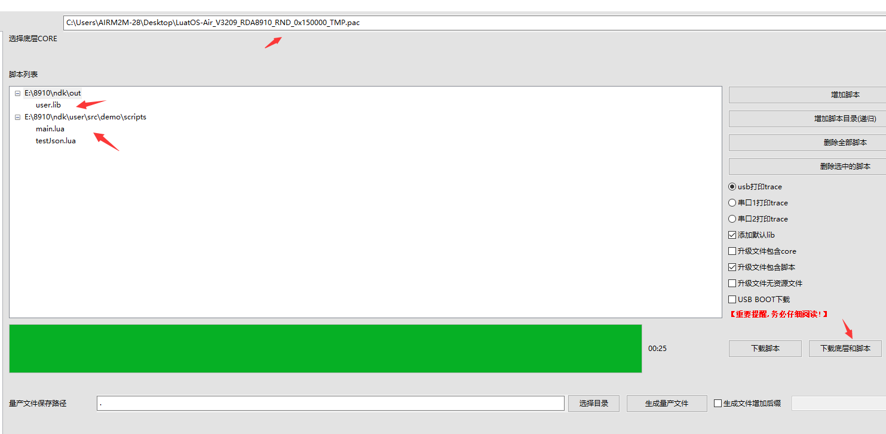

# 一、简介

- **LuatOS NDK定义**

LuatOS NDK(Native Development Kit，以下简称为NDK)是一种本地化接口（芯片硬件提供的原始接口）开发工具集。可以简单的理解为 **使用C/C++开发的接口，可以在lua上直接调用。**  对于商用的LuatOS系统，Lua虚拟机部分是闭源的，用户无法直接集成C/C++代码。NDK正是针对这一场景提供的解决方案，开发简单，容易上手，无需过多关注本地化实现部分。

- **应用场景**

NDK主要针对LuatOS闭源版本（例如LuatOS-Air/LuatOS-HMI/LuatOS-iRTU等)的以下几种场景：
- lua语言运行效率达不到要求，需要用C/C++这类底层语言。
- 已有成熟的C/C++代码需要集成到LuatOS中。
- 希望关键代码能够受到保护，避免lua容易被反编译的风险。
- 向第三方提供闭源lib库。

当然开源版本的LuatOS理论上也可以使用，不过针对开源版本，更建议直接将库源码放到LuatOS源码中构建编译。

- **原理介绍**

用户使用NDK将C代码编译成lib库后，和lua脚本文件一起打包下载到硬件中。LuatOS系统将lib库动态加载到内存中运行，并将lib库中提供的API接口注册到系统中。这样lua脚本就可以通过dl模块进行加载，并使用这类接口。


# 二、目录说明


# 三、使用说明

1. 编译core版本

   通过 http://erp.openluat.com/firm_customized 服务器定制支持NDK功能的固件，版本号>=3209

2. 编译NDK版本

   根据core版本是否支持float功能，选择对应的编译方式。编译结束会在out目录下生成user.lib

   ```
   float版本编译: build.bat FLOAT
   非float版本编译: build.bat 
   ```

3. 下载固件

   

5. 运行结果

    

   


# 四、代码示例

**以RTT COREMARK为例 (RT-Thread上的 MCU/CPU 性能测试小工具)**

- 下载代码

  链接：https://github.com/RT-Thread/rtthread-apps.git

   

- 移植coremark代码

1. 在user\src\demo\lib\路径下创建coremark文件夹。

2. 将core_list_join.c core_main.c core_matrix.c core_portme.c core_state.c coremark.h移到user\src\demo\lib\coremark目录下

3. user\src\demo\lib\coremark目录下添加makefile文件，将coremark里面的c代码参与编译,内容如下:

   ```
   DIRS := 
   SRCS :=	$(wildcard *.c)
   INCS := 
   
   PACKAGE_INC_PATHS := $(BASE_INC_PATHS) 
   BASE_INC_PATHS += 	
   export BASE_INC_PATHS
   include $(MAKE_INCLUDE)
   ```

   user\src\demo\lib\coremark目录如下所示：

    

4. 修改user\src\demo\lib目录下的makefile，将coremark加入编译工程中修改如下所示：

   左边是修改前，右边是修改后

   

5. 运行build.bat.

   运行结果如下所示，coremark代码已经参与编译了，但是还有很多错误

    

6. 添加rttread.h文件，并解决编译错误：(注：下方截图右边都是修改后的)

   - core_list_join.c core_matrix.c core_state.c core_util.c不做任何修改

   - core_main.c 修改如下:

      

   - coremark.h 修改如下:

   - 

   - 其余的所有适配都放到rttread.h. 结果如下所示

      

   - 再次编译start.bat文件，生成了user.lib 结果如下：

      

7. 在user\src\demo\lib\coremark目录下新建lua_coremark.c 将coremark接口封装成lua接口给脚本调用。代码如下所示：

   ```
   #include "core_api.h"
   
   int lua_coremask(void *L)
   {
   	/*coremark入口函数*/
       extern int core_mark(void);
       core_mark();
   
       return 0;
   }
   
   luaL_Reg rtt_lib[] = {
       {"coremark",lua_coremask},
       {NULL, NULL}
   };
   
   ```

8. 在user\src\main.c中注册rtt_lib. 然后再次运行start.bat

   ```
   #include "core_api.h"
   
   /*入口函数*/
   int user_main(void *L)
   {
   
   	/*rtt coremark*/
   	extern luaL_Reg rtt_lib[];
   	luaI_openlib(L, "rtt", rtt_lib, 0);
   
   }
   ```

9. 编写main.lua运行rtt.coremake()

   ```
   PROJECT = "COREMARK"
   VERSION = "1.0.0"
   
   --加载日志功能模块，并且设置日志输出等级
   --如果关闭调用log模块接口输出的日志，等级设置为log.LOG_SILENT即可
   require "log"
   LOG_LEVEL = log.LOGLEVEL_TRACE
   require "sys"
   
   
   --通过dl.open接口加载user.lib文件，并执行user_main入口函数
   --user_main入口函数会注册rtt coremark，然后使用rtt.coremark()进行接口调用
   local handle = dl.open("/lua/user.lib","user_main")
   if handle then  
       rtt.coremark()
       dl.close(handle)
   end
   
   --启动系统框架
   sys.init(0, 0)
   sys.run()
   ```

10. 将main.lua和user.lib一起下载到模块中

    

11. 运行结果如下：

     


# 五、调试说明

- **如何调试死机问题**

可以通过AT指令`AT*EXINFO?`查询死机信息，根据死机信息可以判定死机位置，便于调试和解决问题；测试demo中有添加了该AT指令，如果死机过程中没有死机信息上报，可手动发指令查询。

NDK死机信息：

```
AT*EXINFO?
*EXINFO:poweron=4,assert=func=/lua/user.lib,pc=5ba-line=0-ra=0
*EXINFO:poweron=4,assert=func=/lua/user.lib,pc=5ba-line=0-ra=0
OK
AT*EXINFO? true OK nil
```

如上示`assert=func=/lua/user.lib`信息表明，死机位置位于`user.lib`文件中，可以根据`pc=5ba-line=0-ra=0`信息，在`out/user.map`文件中找到`5ba`所指位置处，定位导致死机的代码。

CORE死机信息：

```
AT*EXINFO?
*EXINFO:poweron=4,assert=func=-line=0-ra=0
*EXINFO:poweron=4,assert=func=-line=0-ra=0
OK
AT*EXINFO? true OK nil
```

如上示未标明`/lua/user.lib`类似信息，即为底层死机

- **常见的异常信息**

1.  [E]-[coroutine.resume] /lua/main.lua:36: dl.open fail relocate_section 620 unknown name: '                     undefFun1'

   导致的原因: user.lib中undefFun1接口未定义

2.  [E]-[coroutine.resume]/lua/main.lua:36: dl.open fail 

   可能是dl.open 库的路径传入不对

3.  [E]-[coroutine.resume] /lua/main.lua:36: dl.sym fail 

   可能是dl.open 入口函数名传入不对


# 六、附件

[api接口介绍](doc/api.md)