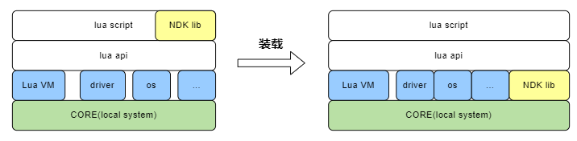
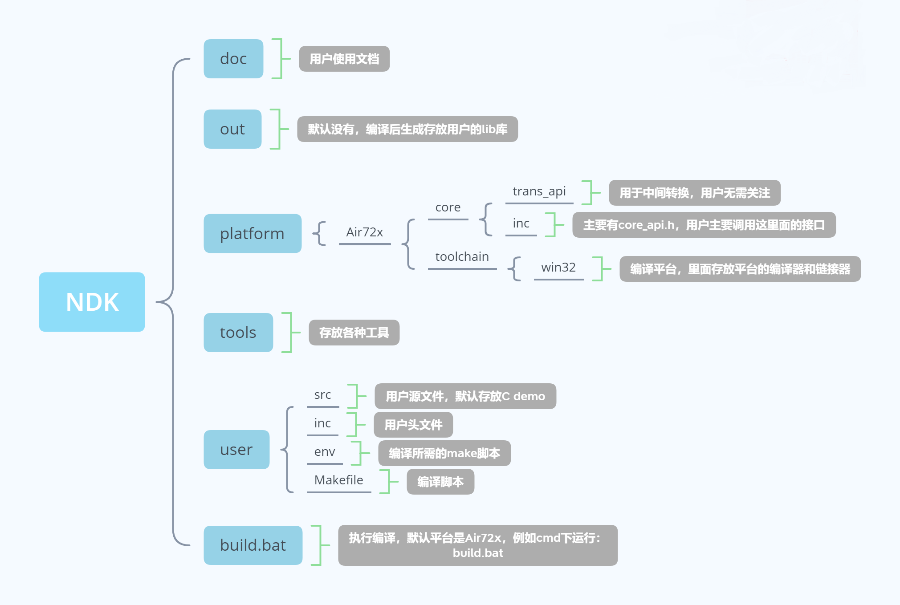
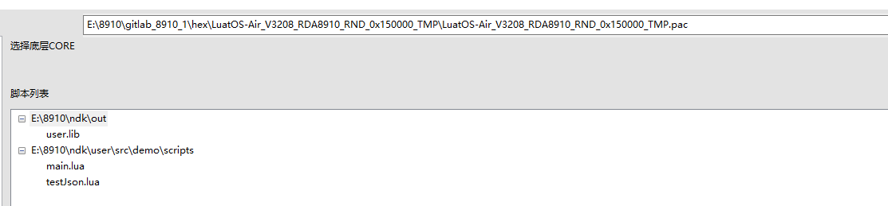

# 一、简介

## LuatOS NDK定义

LuatOS NDK(Native Development Kit，以下简称为NDK)是一种本地化接口（芯片硬件提供的原始接口）开发工具集。可以简单的理解为 **使用C/C++开发的接口，可以在lua上直接调用。**  对于商用的LuatOS系统，Lua虚拟机部分是闭源的，用户无法直接集成C/C++代码。NDK正是针对这一场景提供的解决方案，开发简单，容易上手，无需过多关注本地化实现部分。


## 应用场景
NDK主要针对LuatOS闭源版本（例如LuatOS-Air/LuatOS-HMI/LuatOS-iRTU等)的以下几种场景：
- lua语言运行效率达不到要求，需要用C/C++这类底层语言。
- 已有成熟的C/C++代码需要集成到LuatOS中。
- 希望关键代码能够受到保护，避免lua容易被反编译的风险。
- 向第三方提供闭源lib库。

当然开源版本的LuatOS理论上也可以使用，不过针对开源版本，更建议直接将库源码放到LuatOS源码中构建编译。

## 原理介绍
用户使用NDK将C代码编译成lib库后，和lua脚本文件一起打包下载到硬件中。LuatOS系统将lib库动态加载到内存中运行，并将lib库中提供的API接口注册到系统中。这样lua脚本就可以通过dl模块进行加载，并使用这类接口。



# 二、使用介绍


## NDK目录结构



## 1. 添加源文件

将源文件copy到NDK的`user/src`目录下，头文件相应放到`user/include`目录下。

> 注意：目前的NDK环境默认支持Air72x平台，NDK自带该平台编译器。其他平台需要额外安装编译器，具体步骤待支持其他平台后再补充。

## 2. 修改源文件

### 2.1 调用LuatOS系统本地接口

- 在NDK\platform\xxx\core目录下存放的是底层的头文件，底层提供的接口会全部放在core_api.h里面。

- 用户如果想调用底层的接口，只需要在源码中添加#include "core_api.h" 即可

- 编写好的C库文件仅需要为lua提供相应函数即可。

```c
/*test.c*/
#include "core_api.h"

/*测试函数1，由lua直接调用*/
int fun1(int number)
{
    OPENAT_lua_print("fun1 exe number=%d", number);
    return number;
}

/*测试函数2, 由lua直接调用*/
char* fun2(char *string)
{
    OPENAT_lua_print("fun2 exe string=%s", string);
    fun1(10000);
    return string;
}
```

### 2.2 API接口转化为Lua接口

NDK提供了便捷的API接口转化为Lua接口的方式，通过该方式转换后，用户可以直接使用lib库.xxx的方式调用底层接口，实际使用起来方便很多，具体的实例可以参考`c_to_luaLib_test.c`demo文件。下面主要介绍下转换的几个重要步骤：

1. 定义一个C转lua的接口

   demo中我们定义了`int test_lib(void *L)`接口，注意该接口的参数固定为`void *L`,函数参数不可以变化。是因为lua的调用关系都维护在lua状态机中，我们通过特定的接口就可以获取lua传入的参数了。

2. 获取lua传入的参数

   lua传参的时候通过特定的接口就可以获取到参数了，如`luaL_checkinteger(L,1); `第一个参数就是状态机，lua虚拟机运行的时候传入，第二个参数就是参数索引。这个函数的作用就是获取第几个索引的`int`型参数。**注意：lua的参数索引从1开始**

3. 返回值

   C转lua的接口返回并不能像C函数一样直接`return`，而是需要先压入栈中，再返回参数个数，压入栈的时候要根据参数的不同选择不同的函数。如`lua_pushnumber(L,1000);`代表返回的一个参数为`number`型的数据1000。**注意：压入栈的顺序代表返回参数的顺序**

4. 注册为lua库

   - 先注册表

     ```lua
     luaL_Reg user_lib[] = {
         {"test_lib",test_lib},
         {"test_table",test_table},
         {NULL,NULL}
     };
     ```

     该数组是个结构体数组，结构体中两个元素，第一个代表lua调用时的函数名，第二个代表实际的C转lua函数（第一步中建立的函数）。另外表名也很重要注册的时候需要用。
     
   - 注册为库
   
     lua脚本运行的时候先导入lib，之后获取`handle`，下面会说。获取到`handle`之后调用`dl.register(handle,"userlib","user_lib")`就可以注册lua库了。这里除了传入了`handle`还传入了两个字符串，第一个代表lua调用库时使用的库名，第二个字符串就是上一步的表名。
   
     lua调用方式：`userlib.test_lib`，具体操作可以参考demo。

### 2.3 多线程处理

LuatOS系统提供的lua虚拟机工作在单线程环境，如果添加的源文件代码逻辑中包含多线程，且需要异步通知lua虚拟机，就需要如下函数给lua虚拟机发消息，来通知lua脚本。

  这个应用场景多数是异步操作，执行接口后，需要异步通知lua端，这里引入了消息机制，具体实现如下接口所示：

  ```c
  /*
  发消息通知lua端，下面编写脚本部分会介绍lua端如何接收消息
  函数名：OPENAT_msg_to_lua
  参数：msg_id：用户自定义的消息id，用于区分多种消息
      result：用户自定义的消息结果，默认FALSE
      num: 用户自定义，用于传输数值数据
      data: 用户自定义，用于传输文本数据，用户如果malloc后需要调用该接口后free，底层会做copy
      dataLen：文本数据长度
  */
  
  bool OPENAT_msg_to_lua(UINT8 msg_id,BOOL result,INT32 num,CHAR* data,UINT32 dataLen);
  ```


## 3. 生成lib库文件

- 在NDK根目录下运行`start.bat`。
- 运行结束后会在NDK的根目录下生成`out`文件夹，里面有`user.lib`，就是合成好的静态库。


## 3. 编写lua脚本


### 3.1 lua接口介绍

为了实现静态库的动态加载，NDK版本提供了`dl`库供lua使用，该库目前有dl.open、dl.sym和dl.close三个重要的接口。

#### dl.open

导入静态库

- 语法

  `handle = dl.open(lib)`

- 参数

  | 传入值 | 释义                               |
  | ------ | ---------------------------------- |
  | lib    | lib库所在的路径。如：/lua/user.lib |

- 返回值

  handle：库的句柄

#### dl.sym

动态调用静态库函数

- 语法

  `ret = dl.sym(handle,fun,ret_type,arg1,arg2,arg3....)`

- 参数

  | 传入值   | 释义                                                         |
  | -------- | ------------------------------------------------------------ |
  | handle   | 打开库返回的句柄                                             |
  | fun      | 需要调用的函数名，字符串表示                                 |
  | ret_type | 返回值，目前有两种分别为：*dl.RETURN_NUMBER(可以返回一个bool，int, 句柄等)*    dl.RETURN_STRING(返回一个字符串) |
  | argx     | 函数的参数，可以是number类型和string类型                     |

- 返回值

  ret ：根据参数`ret_type`而返回实际的值。

#### dl.close

卸载动态库

- 语法

  `dl.close(handle)`

- 参数

  | 传入值 | 释义             |
  | ------ | ---------------- |
  | handle | 打开库返回的句柄 |

- 返回值

  nil

​	

### 3.2 lua脚本编写

- 载入库：调用用户自定义的库接口之前，都需要先载入库，使用dl.open接口导入需要的静态库即可；

- 调用库接口：使用dl.sym接口调用库接口：

  ```c
  local ret_number = dl.sym(handle, "fun1", dl.RETURN_NUMBER, 100)
  ```

​		注意：如果没有参数传入，第四个参数可以不填，但是不管有没有参数返回，参数的返回类型必须指定。

- 订阅消息：C与lua之间使用消息机制进行通信，上面说了C库中如何发消息给lua，这里说下lua如何异步接收C库传的消息：

  ```Lua
  local function dl_msg_pro(msg)
      print(msg.msg,msg.num,msg.data,msg.result)
  end
  
  rtos.on(rtos.MSG_DL_INFO, dl_msg_pro)
  ```

- 卸载库:

​		如果您之后的lua代码不在需要用到dl.open导入的静态库文件，可以使用dl.close卸载该静态库，释放内存，保证较高的执行效率。


# 三、固件下载

- 底层固件选择支持NDK的固件库。
- 通过增加脚本文件按钮，选择lua脚本和NDK\out目录下的user.lib，如下图所示：



- 点击下载即可。


# 四、代码示例

## C库demo

```c
/*test.c*/
#include "core_api.h"

/*测试函数1，由lua直接调用*/
int fun1(int number)
{
    OPENAT_lua_print("fun1 exe number=%d", number);
    return number;
}

/*测试函数2, 由lua直接调用*/
char* fun2(char *string)
{
    OPENAT_lua_print("fun2 exe string=%s", string);
    fun1(10000);
    return string;
}
```

## lua脚本demo

```lua
PROJECT = "DL_TEST"
VERSION = "1.0.0"

--加载日志功能模块，并且设置日志输出等级
--如果关闭调用log模块接口输出的日志，等级设置为log.LOG_SILENT即可
require "log"
LOG_LEVEL = log.LOGLEVEL_TRACE
require "sys"

rtos.sleep(3000)
--导入user.lib库
local handle = dl.open("/lua/user.lib")
--判断库是否导入成功
if handle then  
    --调用fun1，并指定返回值为RETURN_NUMBER类型，传入的参数是100
    local ret_number = dl.sym(handle, "fun1", dl.RETURN_NUMBER, 100)
    local ret_string = dl.sym(handle, "fun2", dl.RETURN_STRING, "hello")

    print("ret_number", ret_number);
    print("ret_string", ret_string);
    --卸载库
    dl.close(handle)
end

--启动系统框架
sys.init(0, 0)
sys.run()
```

运行结果：

```
fun1 exe number=100
fun2 exe string=hello
ret_number 100
ret_string hello
```

