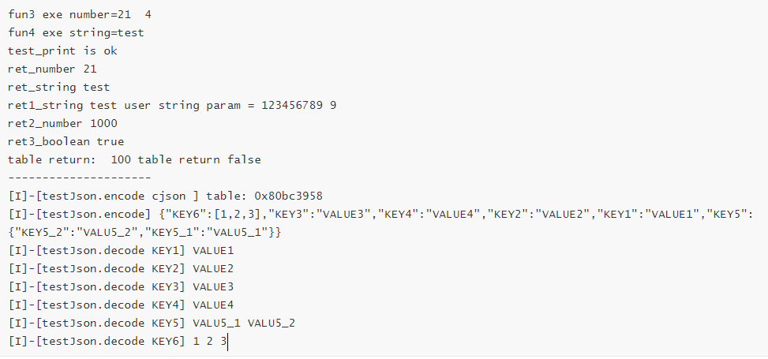

# 一、简介

- **LuatOS NDK定义**

LuatOS NDK(Native Development Kit，以下简称为NDK)是一种本地化接口（芯片硬件提供的原始接口）开发工具集。可以简单的理解为 **使用C/C++开发的接口，可以在lua上直接调用。**  对于商用的LuatOS系统，Lua虚拟机部分是闭源的，用户无法直接集成C/C++代码。NDK正是针对这一场景提供的解决方案，开发简单，容易上手，无需过多关注本地化实现部分。

- **应用场景**

NDK主要针对LuatOS闭源版本（例如LuatOS-Air/LuatOS-HMI/LuatOS-iRTU等)的以下几种场景：
- lua语言运行效率达不到要求，需要用C/C++这类底层语言。
- 已有成熟的C/C++代码需要集成到LuatOS中。
- 希望关键代码能够受到保护，避免lua容易被反编译的风险。
- 向第三方提供闭源lib库。

当然开源版本的LuatOS理论上也可以使用，不过针对开源版本，更建议直接将库源码放到LuatOS源码中构建编译。

- **原理介绍**

用户使用NDK将C代码编译成lib库后，和lua脚本文件一起打包下载到硬件中。LuatOS系统将lib库动态加载到内存中运行，并将lib库中提供的API接口注册到系统中。这样lua脚本就可以通过dl模块进行加载，并使用这类接口。


# 二、目录说明


#  三、接口说明

**dl.open**

加载静态库并执行入口函数

- 语法

  `handle = dl.open(lib,main)`

- 参数

  | 传入值 | 释义                               |
  | ------ | ---------------------------------- |
  | lib    | lib库所在的路径。如：/lua/user.lib |
  | main   | lib库的入口函数                    |

- 返回值

  handle：库的句柄

**dl.close**

卸载动态库

- 语法

  `dl.close(handle)`

- 参数

  | 传入值 | 释义             |
  | ------ | ---------------- |
  | handle | 打开库返回的句柄 |

- 返回值

  nil

**MSG_DL_INFO**

lib库消息上报

- 语法

  ```
  local function dl_msg_pro(msg)
      print(msg.msg,msg.num,msg.data,msg.result)
  end
  
  rtos.on(rtos.MSG_DL_INFO, dl_msg_pro)
  ```

**luaL_checklstring**

获取字符串类型参数

- 语法

  ```
  const char *luaL_checklstring (void *L, int narg, size_t *len)
  ```

- 参数

  | 传入值 | 释义                 |
  | ------ | -------------------- |
  | L      | 状态机句柄           |
  | narg   | 参数索引             |
  | len    | 获取字符串参数的长度 |

- 返回值

  const char*类型的字符串

**luaL_checkinteger**

获取lua_Integer类型参数

- 语法

  ```
  lua_Integer *luaL_checkinteger (void *L, int narg)
  ```

- 参数

  | 传入值 | 释义       |
  | ------ | ---------- |
  | L      | 状态机句柄 |
  | narg   | 参数索引   |

- 返回值

  lua_Integer类型的数值

**lua_pushstring**

返回字符串类型参数

- 语法

  ```
  void lua_pushstring (lua_State *L, const char *s)
  ```

- 参数

  | 传入值 | 释义                  |
  | ------ | --------------------- |
  | L      | 状态机句柄            |
  | s      | const char*类型字符串 |

- 返回值

  无

**lua_pushnumber**

返回lua_Integer类型参数

- 语法

  ```
  void lua_pushnumber (lua_State *L, lua_Number n)
  ```

- 参数

  | 传入值 | 释义               |
  | ------ | ------------------ |
  | L      | 状态机句柄         |
  | n      | lua_Number类型数值 |

- 返回值

  无

**lua_pushinteger**

返回lua_Integer类型参数

- 语法

  ```
  void lua_pushinteger (lua_State *L, lua_Integer n)
  ```

- 参数

  | 传入值 | 释义                |
  | ------ | ------------------- |
  | L      | 状态机句柄          |
  | n      | lua_Integer类型数值 |

- 返回值

  无

# 四、使用说明

1. 编译core版本

   通过http://erp.openluat.com/firm_customized服务器定制支持NDK功能的固件，版本号>=3209

2. 编译NDK版本

   根据core版本是否支持float功能，选择对应的编译方式。编译结束会在out目录下生成user.lib

   ```
   float版本编译: start.bat FLOAT
   非float版本编译: start.bat 
   ```

3. 下载固件

   

5. 运行结果

    

   


# 五、代码示例

**添加RTT COREMARK:RT-Thread 上的 MCU/CPU 性能测试小工具**

- 下载代码

  链接：https://github.com/RT-Thread/rtthread-apps.git

   

- 移植coremark代码

1. 在ndk user\src\demo\lib\路径下创建coremark文件夹。

2. 将core_list_join.c core_main.c core_matrix.c core_portme.c core_state.c coremark.h移到user\src\demo\lib\coremark目录下

3. user\src\demo\lib\coremark目录下添加makefile文件，将coremark里面的c代码参与编译,内容如下:

   ```
   DIRS := 
   SRCS :=	$(wildcard *.c)
   INCS := 
   
   PACKAGE_INC_PATHS := $(BASE_INC_PATHS) 
   BASE_INC_PATHS += 	
   export BASE_INC_PATHS
   include $(MAKE_INCLUDE)
   ```

   user\src\demo\lib\coremark目录如下所示：

    

4. 修改user\src\demo\lib目录下的makefile，将coremark加入编译工程中修改如下所示：

   左边是修改前，右边是修改后

   

5. 运行ndk下start.bat.

   运行结果如下所示，coremark代码已经参与编译了，但是还有很多错误

    

6. 添加rttread.h文件，并解决编译错误：(注：下方截图右边都是修改后的)

   - core_list_join.c core_matrix.c core_state.c core_util.c不做任何修改

   - core_main.c 修改如下:

      

   - coremark.h 修改如下:

   - 

   - 其余的所有适配都放到rttread.h. 结果如下所示

      

   - 再次编译start.bat文件，生成了user.lib 结果如下：

      

7. 在user\src\demo\lib\coremark目录下新建lua_coremark.c 将coremark接口封装成lua接口给脚本调用。代码如下所示：

   ```
   #include "core_api.h"
   
   int lua_coremask(void *L)
   {
   	/*coremark入口函数*/
       extern int core_mark(void);
       core_mark();
   
       return 0;
   }
   
   luaL_Reg rtt_lib[] = {
       {"coremark",lua_coremask},
       {NULL, NULL}
   };
   
   ```

8. 在user\src\main.c中注册rtt_lib. 然后再次运行start.bat

   ```
   #include "core_api.h"
   
   /*入口函数*/
   int user_main(void *L)
   {
   
   	/*rtt coremark*/
   	extern luaL_Reg rtt_lib[];
   	luaI_openlib(L, "rtt", rtt_lib, 0);
   
   }
   ```

9. 编写main.lua运行rtt.coremake()

   ```
   PROJECT = "COREMARK"
   VERSION = "1.0.0"
   
   --加载日志功能模块，并且设置日志输出等级
   --如果关闭调用log模块接口输出的日志，等级设置为log.LOG_SILENT即可
   require "log"
   LOG_LEVEL = log.LOGLEVEL_TRACE
   require "sys"
   
   
   --通过dl.open接口加载user.lib文件，并执行user_main入口函数
   --user_main入口函数会注册rtt coremark，然后使用rtt.coremark()进行接口调用
   local handle = dl.open("/lua/user.lib","user_main")
   if handle then  
       rtt.coremark()
       dl.close(handle)
   end
   
   --启动系统框架
   sys.init(0, 0)
   sys.run()
   ```

10. 将main.lua和user.lib一起下载到模块中

    

11. 运行结果如下：

     


# 六、调试说明

- **如何查询哪些接口未定义**

由于最终编译的user.lib库未参与链接，所以会未定义的函数并不会报错。虽然运行的时候会有错误提示，但是调试效率太低。

例如下面代码： undefFun1和undefFun2、undefFun3都是未定义的函数。但实际上编译并没有报错。

```
static void undefTest(void)
{
  undefFun1();
  undefFun2();
  undefFun3();
}
```

如何查找未定义函数：

1. 编译结束会在out目录下生成对应的map文件

2. 打开map文件搜索UND如下所示:

    

   对于user.lib来说，编译器添加的接口也属于未定义接口，所以我们只要排除编译器添加的接口，剩下的都是我们需要去实现的。下面的接口就是编译器添加的接口。

   ```
   {"memset"},
   {"memcpy"},
   {"__aeabi_idiv"},
   {"__aeabi_idivmod"},
   {"__divsi3"},
   {"__aeabi_uidivmod"},
   {"__aeabi_uidiv"},
   {"__aeabi_ldivmod"},
   {"__aeabi_uldivmod"},
   {"__aeabi_drsub"},
   {"__subdf3"},
   {"__aeabi_dadd"},
   {"__floatunsidf"},
   {"__floatsidf"},
   {"__extendsfdf2"},
   {"__floatundidf"},
   {"__floatdidf"},
   {"__fixdfdi"},
   {"__fixunsdfdi"},
   {"__udivmoddi4"},
   {"__udivsi3"},
   ```

3. 排除编译器提供的接口，我们就能明显的发现undefFun1和undefFun2、undefFun3都是未定义接口。

- **如何调试死机问题**

可以通过AT指令`AT*EXINFO?`查询死机信息，根据死机信息可以判定死机位置，便于调试和解决问题；测试demo中有添加了该AT指令，如果死机过程中没有死机信息上报，可手动发指令查询。

NDK死机信息：

```
AT*EXINFO?
*EXINFO:poweron=4,assert=func=/lua/user.lib,pc=5ba-line=0-ra=0
*EXINFO:poweron=4,assert=func=/lua/user.lib,pc=5ba-line=0-ra=0
OK
AT*EXINFO? true OK nil
```

如上示`assert=func=/lua/user.lib`信息表明，死机位置位于`user.lib`文件中，可以根据`pc=5ba-line=0-ra=0`信息，在`out/user.map`文件中找到`5ba`所指位置处，定位导致死机的代码。

CORE死机信息：

```
AT*EXINFO?
*EXINFO:poweron=4,assert=func=-line=0-ra=0
*EXINFO:poweron=4,assert=func=-line=0-ra=0
OK
AT*EXINFO? true OK nil
```

如上示未标明`/lua/user.lib`类似信息，即为底层死机

- **常见的异常信息**

1.  [E]-[coroutine.resume] /lua/main.lua:36: dl.open fail relocate_section 620 unknown name: '                     undefFun1'

   导致的原因: user.lib中undefFun1接口未定义

2.  [E]-[coroutine.resume]/lua/main.lua:36: dl.open fail 

   可能是dl.open 库的路径传入不对

3.  [E]-[coroutine.resume] /lua/main.lua:36: dl.sym fail 

   可能是dl.open 入口函数名传入不对