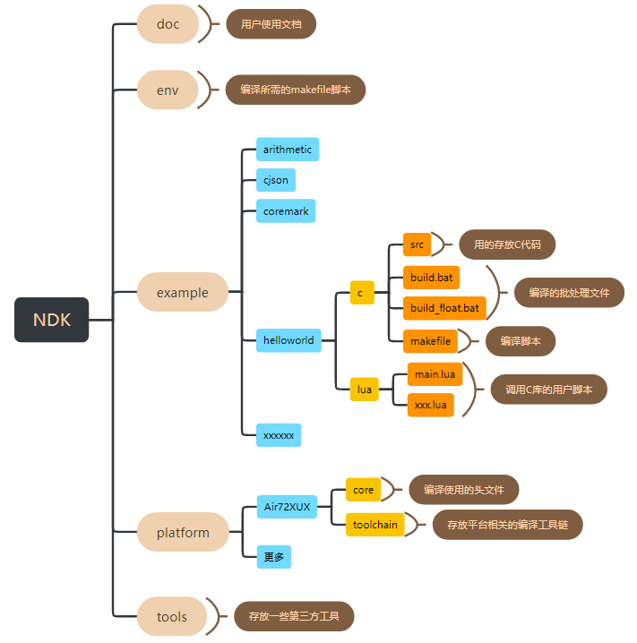
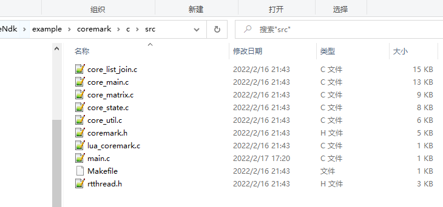

# 一、简介

## LuatOS NDK定义

LuatOS NDK(Native Development Kit，以下简称为NDK)是一种本地化接口（芯片硬件提供的原始接口）开发工具集。可以简单的理解为 **使用C/C++开发的接口，可以在lua上直接调用。**  对于商用的LuatOS系统，Lua虚拟机部分是闭源的，用户无法直接集成C/C++代码。NDK正是针对这一场景提供的解决方案，开发简单，容易上手，无需过多关注本地化实现部分。


## 应用场景
NDK主要针对LuatOS闭源版本（例如LuatOS-Air/LuatOS-HMI/LuatOS-iRTU等)的以下几种场景：
- lua语言运行效率达不到要求，需要用C/C++这类底层语言。
- 已有成熟的C/C++代码需要集成到LuatOS中。
- 希望关键代码能够受到保护，避免lua容易被反编译的风险。
- 向第三方提供闭源lib库。

当然开源版本的LuatOS理论上也可以使用，不过针对开源版本，更建议直接将库源码放到LuatOS源码中构建编译。


## 原理介绍
用户使用NDK将C代码编译成lib库后，和lua脚本文件一起打包下载到硬件中。LuatOS系统将lib库动态加载到内存中运行，并将lib库中提供的API接口注册到系统中。这样lua脚本就可以通过dl模块进行加载，并使用这类接口。


# 二、使用介绍


## NDK目录结构



## 1. 添加源文件

- 将源文件copy到NDK的`user/src`目录下，头文件相应放到`user/include`目录（如果没有可以手动创建，编译时自动生成）下。

	> 注意：目前的NDK环境默认支持Air72x平台，NDK自带该平台编译器。其他平台需要额外安装编译器，具体步骤待支持其他平台后再补充。

- 如果项目`user/src`目录下包含子源文件夹，请修改该目录下的Makefile，DIRS后添加子源文件夹路径，同时在相应子源文件夹添加Makefile文件，Makefile参考如下：

  ```makefile
  DIRS := demo
  SRCS :=	$(wildcard *.c)
  INCS := 
  
  PACKAGE_INC_PATHS := 	$(BASE_INC_PATHS)
  
  include $(MAKE_INCLUDE)
  ```

- 如果项目`user/src`目录下还包含头文件夹，请修改该目录下的Makefile，BASE_INC_PATHS添加头文件夹路径，Makefile参考如下：

  ```makefile
  DIRS := source
  SRCS :=	$(wildcard *.c)
  INCS := 
  
  PACKAGE_INC_PATHS := 	$(BASE_INC_PATHS)
  BASE_INC_PATHS += 	$(BUILD_ROOT)/src/demo/include
  
  export BASE_INC_PATHS
  
  include $(MAKE_INCLUDE)
  ```

## 2. 修改源文件

- 在NDK\platform\xxx\core目录下存放的是底层的头文件，底层提供的接口会全部放在core_api.h里面。

- 用户如果想调用底层的接口，只需要在源码中添加#include "core_api.h" 即可

- 编写好的C库文件仅需要为lua提供相应函数即可。

  

## 3. 生成lib库文件

- 在NDK根目录下运行`start.bat`，编译正常版本。
- 在NDK根目录下运行`start.bat` `FLOAT`，编译生成float版本。
- 运行结束后会在NDK的根目录下生成`out`文件夹，里面有`user.lib`，就是合成好的静态库。


### 3.1 lua接口介绍

**可以参考代码示例**

**dl.open**

加载静态库并执行入口函数

- 语法

  `handle = dl.open(lib,main)`

- 参数

  | 传入值 | 释义                               |
  | ------ | ---------------------------------- |
  | lib    | lib库所在的路径。如：/lua/user.lib |
  | main   | lib库的入口函数                    |

- 返回值

  handle：库的句柄

**dl.close**

卸载动态库

- 语法

  `dl.close(handle)`

- 参数

  | 传入值 | 释义             |
  | ------ | ---------------- |
  | handle | 打开库返回的句柄 |

- 返回值

  nil

**MSG_DL_INFO**

lib库消息上报

- 语法

  ```
  local function dl_msg_pro(msg)
      print(msg.msg,msg.num,msg.data,msg.result)
  end
  
  rtos.on(rtos.MSG_DL_INFO, dl_msg_pro)
  ```

### 3.2 lua和c常见的参数传递接口

**可以参考代码示例**

**luaL_checklstring**

获取字符串类型参数

- 语法

  ```
  const char *luaL_checklstring (void *L, int narg, size_t *len)
  ```

- 参数

  | 传入值 | 释义                 |
  | ------ | -------------------- |
  | L      | 状态机句柄           |
  | narg   | 参数索引             |
  | len    | 获取字符串参数的长度 |

- 返回值

  const char*类型的字符串

**luaL_checkinteger**

获取lua_Integer类型参数

- 语法

  ```
  lua_Integer *luaL_checkinteger (void *L, int narg)
  ```

- 参数

  | 传入值 | 释义       |
  | ------ | ---------- |
  | L      | 状态机句柄 |
  | narg   | 参数索引   |

- 返回值

  lua_Integer类型的数值

**lua_pushstring**

返回字符串类型参数

- 语法

  ```
  void lua_pushstring (lua_State *L, const char *s)
  ```

- 参数

  | 传入值 | 释义                  |
  | ------ | --------------------- |
  | L      | 状态机句柄            |
  | s      | const char*类型字符串 |

- 返回值

  无

**lua_pushnumber**

返回lua_Integer类型参数

- 语法

  ```
  void lua_pushnumber (lua_State *L, lua_Number n)
  ```

- 参数

  | 传入值 | 释义               |
  | ------ | ------------------ |
  | L      | 状态机句柄         |
  | n      | lua_Number类型数值 |

- 返回值

  无

**lua_pushinteger**

返回lua_Integer类型参数

- 语法

  ```
  void lua_pushinteger (lua_State *L, lua_Integer n)
  ```

- 参数

  | 传入值 | 释义                |
  | ------ | ------------------- |
  | L      | 状态机句柄          |
  | n      | lua_Integer类型数值 |

- 返回值

  无

# 三、固件下载

- 底层固件选择支持NDK的固件库

  通过http://erp.openluat.com/firm_customized服务器定制支持NDK功能的固件，版本号>=3209

- 通过增加脚本文件按钮，选择lua脚本和NDK\out目录下的user.lib，如下图所示：

  

- 点击下载即可。

  > 需要注意的是，float版本的ndk需要对应float版本的core文件


# 四、代码示例

## 1. C库demo

```c
/*编译成user.lib*/
#include "core_api.h"

int test(void *L)
{
    /*获取第一个参数*/
    int strSize;
    char *string  = luaL_checklstring(L,1, &strSize);
    /*获取第二个参数*/
    int num  = luaL_checkinteger(L, 2);
    OPENAT_lua_print("test exe %s,%d", string, num);
    /*返回第一个参数*/
    lua_pushinteger(L, 100);
    /*返回2个参数*/
    lua_pushstring(L, string);
    /*返回参数个数*/
	return 2;
}

/*C函数表*/
const luaL_Reg user_map[] =
{
	{"test", test},
	{NULL, NULL}
};

/*入口函数*/
int user_main(void *L)
{
    OPENAT_lua_print("user_main exe");

	/*C函数注册*/
	luaI_openlib(L, "user", user_map, 0);

    /*其他初始化*/
	return 0;
}

```

## 2. lua脚本demo

```lua
PROJECT = "DL_TEST"
VERSION = "1.0.0"

--加载日志功能模块，并且设置日志输出等级
--如果关闭调用log模块接口输出的日志，等级设置为log.LOG_SILENT即可
require "log"
LOG_LEVEL = log.LOGLEVEL_TRACE
require "sys"

rtos.sleep(3000)

--通过dl.open接口加载user.lib文件，并执行user_main入口函数
--user_main入口函数会将user_map注册到虚拟机中，然后使用user.test（）进行接口调用
local handle = dl.open("/lua/user.lib","user_main")
if handle then  
    print("user",user);
    local len,string = user.test("hello", 99)
    print("string",string)
    print("len",len)
    dl.close(handle)
end

--启动系统框架
sys.init(0, 0)
sys.run()
```

运行结果：

```
user_main exe
user table: 0x80a203a0
test exe hello,99
string hello
len 100
```

## 3. 测试demo

目前支持的测试demo，包括常规测试和cJSON测试：

常规测试，主要为针对一些硬件接口、系统接口和lua虚拟机接口进行的测试;

> 例如：uart和gpio的硬件接口测试、task和message的系统接口测试以及参数获取和压栈操作的lua虚拟机接口的测试；

cJSON测试，主要移植了`JSON`数据解析器进行测试，实现了`JSON`数据的`lua`编解码等接口。

```lua
PROJECT = "DL_TEST"
VERSION = "1.0.0"

--加载日志功能模块，并且设置日志输出等级
--如果关闭调用log模块接口输出的日志，等级设置为log.LOG_SILENT即可
require "log"
LOG_LEVEL = log.LOGLEVEL_TRACE
require "sys"
require "ril"

-- 打印死机信息
ril.request("AT*EXINFO?")
rtos.sleep(3000)
--[[
dl模块接口定义
函数：handle=dl.open(libpath,usermap)
功能：加载c编译的lib文件
  参数：
      --path:lib的路径,string类型
      --usermap:lua函数接口注册表
  返回值：
      --handle:成功返回句柄，失败返回nil

  函数： ret = dl.close(handle)
  功能：卸载lib
      参数：
          handle:dl.open的返回值
      返回值：nil
]]

-- 常规测试
sys.taskInit(function ()
  local handle = dl.open("/lua/user.lib","user_main")
  if handle then
      --添加测试demo
      local ret_number = user.test_fun3(21)
      local ret_string = user.test_fun4(21,"test")
      local ret1,ret2,ret3 = user.test_function(1000,"123456789")
      local t = user.test_table()

      print("ret_number", ret_number);
      print("ret_string", ret_string);
      print("ret1_string",ret1)
      print("ret2_number",ret2)
      print("ret3_boolean",ret3)
      print("table return: ",t.num,t.str,t.bool)

      print("---------------------")

      -- user.test_uart()
      -- user.send_msg_to_lua_test()
      -- user.test_msg(20000)
      -- user.test_timer()
      -- user.test_task()
      -- 点亮LED灯,uart2发lightLED:2,1,10,启动LED,亮2秒，灭1秒，闪10次
      -- pmd.ldoset(1,pmd.LDO_VLCD)
      -- user.test_light_led()

      -- NDK死机测试
      -- sys.wait(3000)
      -- user.test_dump()

      -- dl.close(handle)
  end
end)

-- cjson测试
require "testJson"

local function dl_msg_pro(msg)
    print(msg.msg,msg.num,msg.data,msg.result)
end

rtos.on(rtos.MSG_DL_INFO, dl_msg_pro)

--启动系统框架
sys.init(0, 0)
sys.run()
```

运行结果：

```
fun3 exe number=21  4
fun4 exe string=test
test_print is ok
ret_number 21
ret_string test
ret1_string test user string param = 123456789 9
ret2_number 1000
ret3_boolean true
table return:  100 table return false
---------------------
[I]-[testJson.encode cjson ] table: 0x80b8b5f8
[I]-[testJson.encode] {"KEY6":[1,2,3],"KEY3":"VALUE3","KEY4":"VALUE4","KEY2":"VALUE2","KEY1":"VALUE1","KEY5":{"KEY5_2":"VALU5_2","KEY5_1":"VALU5_1"}}
[I]-[testJson.decode KEY1] VALUE1
[I]-[testJson.decode KEY2] VALUE2
[I]-[testJson.decode KEY3] VALUE3
[I]-[testJson.decode KEY4] VALUE4
[I]-[testJson.decode KEY5] VALU5_1 VALU5_2
[I]-[testJson.decode KEY6] 1 2 3

AT*EXINFO?
*EXINFO:poweron=3
*EXINFO:poweron=3
OK
AT*EXINFO? true OK nil
```

> 本运行结果仅展示cJSON示例结果，其他测试可自行打开演示。

此外，如需删除该测试demo，可相应修改user/src目录下main.c文件中的入口注册函数，并删除user/src目录下Makefile文件中的demo路径即可。

## 4. 添加RTT COREMARK示例

### 1.  COREMARK概述

RT-Thread 上的 MCU/CPU 性能测试小工具

### 2. 下载COREMARK代码

链接：https://github.com/RT-Thread/rtthread-apps.git

coremark代码如下所示：

 

### 3. 移植coremark代码

1. 在ndk user\src\demo\lib\路径下创建coremark文件夹。

2. 将core_list_join.c core_main.c core_matrix.c core_portme.c core_state.c coremark.h移到user\src\demo\lib\coremark目录下

3. user\src\demo\lib\coremark目录下添加makefile文件，将coremark里面的c代码参与编译,内容如下:

   ```
   DIRS := 
   SRCS :=	$(wildcard *.c)
   INCS := 
   
   PACKAGE_INC_PATHS := $(BASE_INC_PATHS) 
   BASE_INC_PATHS += 	
   export BASE_INC_PATHS
   include $(MAKE_INCLUDE)
   ```

   user\src\demo\lib\coremark目录如下所示：

    

4. 修改user\src\demo\lib目录下的makefile，将coremark加入编译工程中修改如下所示：

   左边是修改前，右边是修改后

   

5. 运行ndk下start.bat.

   运行结果如下所示，coremark代码已经参与编译了，但是还有很多错误

    

6. 添加rttread.h文件，并解决编译错误：(注：下方截图右边都是修改后的)

   - core_list_join.c core_matrix.c core_state.c core_util.c不做任何修改

   - core_main.c 修改如下

      

   - coremark.h 修改如下:

   

   - 其余的所有适配都放到rttread.h. 结果如下所示

      

   - 再次编译start.bat文件，生成了user.lib 结果如下：

      

7. 在user\src\demo\lib\coremark目录下新建lua_coremark.c 将coremark接口封装成lua接口给脚本调用。代码如下所示：

   ```
   #include "core_api.h"
   
   int lua_coremask(void *L)
   {
   	/*coremark入口函数*/
       extern int core_mark(void);
       core_mark();
   
       return 0;
   }
   
   luaL_Reg rtt_lib[] = {
       {"coremark",lua_coremask},
       {NULL, NULL}
   };
   
   ```

8. 在user\src\main.c中注册rtt_lib. 然后再次运行start.bat

   ```
   #include "core_api.h"
   
   /*入口函数*/
   int user_main(void *L)
   {
   
   	/*rtt coremark*/
   	extern luaL_Reg rtt_lib[];
   	luaI_openlib(L, "rtt", rtt_lib, 0);
   
   }
   ```

9. 编写main.lua运行rtt.coremake()

   ```
   PROJECT = "COREMARK"
   VERSION = "1.0.0"
   
   --加载日志功能模块，并且设置日志输出等级
   --如果关闭调用log模块接口输出的日志，等级设置为log.LOG_SILENT即可
   require "log"
   LOG_LEVEL = log.LOGLEVEL_TRACE
   require "sys"
   
   
   --通过dl.open接口加载user.lib文件，并执行user_main入口函数
   --user_main入口函数会注册rtt coremark，然后使用rtt.coremark()进行接口调用
   local handle = dl.open("/lua/user.lib","user_main")
   if handle then  
       rtt.coremark()
       dl.close(handle)
   end
   
   --启动系统框架
   sys.init(0, 0)
   sys.run()
   ```

10. 将main.lua和user.lib一起下载到模块中

    

11. 运行结果如下：

     


# 五、调试

## 1. 如何查询哪些接口未定义

由于最终编译的user.lib库未参与链接，所以会未定义的函数并不会报错。虽然运行的时候会有错误提示，但是调试效率太低。

例如下面代码： undefFun1和undefFun2、undefFun3都是未定义的函数。但实际上编译并没有报错。

```
static void undefTest(void)
{
  undefFun1();
  undefFun2();
  undefFun3();
}
```

如何查找未定义函数：

1. 编译结束会在out目录下生成对应的map文件

2. 打开map文件搜索UND如下所示:

    

   对于user.lib来说，编译器添加的接口也属于未定义接口，所以我们只要排除编译器添加的接口，剩下的都是我们需要去实现的。下面的接口就是编译器添加的接口。

   ```
   {"memset"},
   {"memcpy"},
   {"__aeabi_idiv"},
   {"__aeabi_idivmod"},
   {"__divsi3"},
   {"__aeabi_uidivmod"},
   {"__aeabi_uidiv"},
   {"__aeabi_ldivmod"},
   {"__aeabi_uldivmod"},
   {"__aeabi_drsub"},
   {"__subdf3"},
   {"__aeabi_dadd"},
   {"__floatunsidf"},
   {"__floatsidf"},
   {"__extendsfdf2"},
   {"__floatundidf"},
   {"__floatdidf"},
   {"__fixdfdi"},
   {"__fixunsdfdi"},
   {"__udivmoddi4"},
   {"__udivsi3"},
   ```

3. 排除编译器提供的接口，我们就能明显的发现undefFun1和undefFun2、undefFun3都是未定义接口。

## 2. 如何调试死机问题

可以通过AT指令`AT*EXINFO?`查询死机信息，根据死机信息可以判定死机位置，便于调试和解决问题；测试demo中有添加了该AT指令，如果死机过程中没有死机信息上报，可手动发指令查询。

NDK死机信息：

```
AT*EXINFO?
*EXINFO:poweron=4,assert=func=/lua/user.lib,pc=5ba-line=0-ra=0
*EXINFO:poweron=4,assert=func=/lua/user.lib,pc=5ba-line=0-ra=0
OK
AT*EXINFO? true OK nil
```

如上示`assert=func=/lua/user.lib`信息表明，死机位置位于`user.lib`文件中，可以根据`pc=5ba-line=0-ra=0`信息，在`out/user.map`文件中找到`5ba`所指位置处，定位导致死机的代码。

CORE死机信息：

```
AT*EXINFO?
*EXINFO:poweron=4,assert=func=-line=0-ra=0
*EXINFO:poweron=4,assert=func=-line=0-ra=0
OK
AT*EXINFO? true OK nil
```

如上示未标明`/lua/user.lib`类似信息，即为底层死机

## 3. 常见的异常信息

1.  [E]-[coroutine.resume] /lua/main.lua:36: dl.open fail relocate_section 620 unknown name: '                     undefFun1'

   导致的原因: user.lib中undefFun1接口未定义

2.  [E]-[coroutine.resume]/lua/main.lua:36: dl.open fail 

   可能是dl.open 库的路径传入不对

3.  [E]-[coroutine.resume] /lua/main.lua:36: dl.sym fail 

   可能是dl.open 入口函数名传入不对